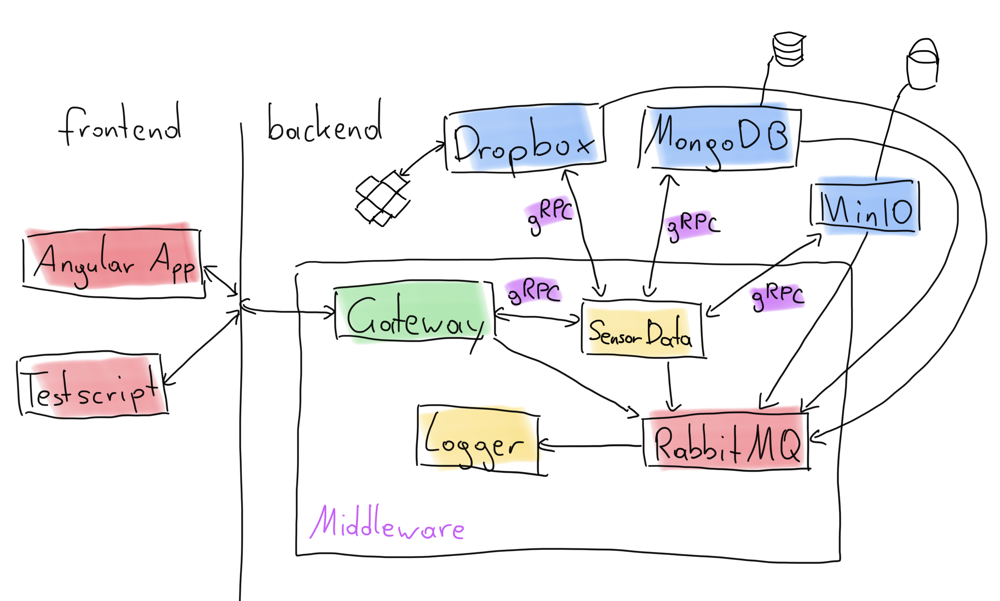

# Advanced Internet Computing WS 2021 - Group 4 Topic 2

## Team

- Sebastian Fürndraht (11741163)
- Simon Hofbauer (11701818)
- Lukas Spatschil (11810356)
- Lukas Wieser (11809647)

## Work Distribution

- Sebastian Fürndraht (11741163)
    - Image Storage Interface
    - MinIO Service
    - Update of Pictures and Metadata
    - Bugfixing
- Simon Hofbauer (11701818)
    - Rest API Decleration
    - Dropbox Service
    - Picture Recovery
    - Bugfixing
- Lukas Spatschil (11810356)
    - Initial Architecture Setup
    - Logger Service
    - MongoDB Service
    - Frontend Angular App
    - workflow and iotdummy scripts
    - Docker files
    - Bugfixing
- Lukas Wieser (11809647)
    - SensorData Storage Interface
    - SensorData Service
    - gRPC Error Handler
    - Docker files
    - Bugfixing

## Overview

This is the second topic of the Advanced Internet Computing WS 2021 - Group 4. It implements a simple federated storage infrastructure for IoT devices.

It consists of a server and a client. The server is responsible for storing the data of the devices and the client is responsible for sending the data to the server and interacting with the existing data.

Cors is disabled in order to allow IoT devices to access the server.

DON'T USE IN PRODUCTION SINCE THERE ARE NO SECURITY FEATURES IMPLEMENTED!

## A basic usecase

An IoT device in nature takes a picture of wildlife if the camera trap is triggered. The data consisting of a picture plus the metadata is sent by the IoT device via an API to the application. The application stores the metadata in a storage and the picture file in two different file storages. An AI tool can access the stored data via the API and perform updates on the stored data. For example, after tagging a picture with image recognition and adding the additional information by updating the data via the API. Users can view and interact with the data via a Web UI that allows to perform manual actions.

## How to run

In order to start all services of the application run `docker-compose up`.

When running, our services can be reached here: 

* Frontend:               `localhost:8080`
* API:                    `localhost:3000`
* API Documentation:      `localhost:3000/api`

### Configuration and environment variables

In the file `./.develop.env` you can configure some options via the following variables 

* LoggerService
    *  LOG_FILE_PATH: where the log file should be saved
* RabbitMQ
    *  RABBITMQ_USERNAME: Username for the RabbitMQ
    *  RABBITMQ_PASSWORD: Password for the RabbitMQ
    *  RABBITMQ_URL: Connection URL to the RabbitMQ
    *  RABBITMQ_PORT: Port for the RabbitMQ
* Dropbox
    *  DROPBOX_ACCESSTOKEN: Accesstoken for Dropbox API
    *  DROPBOX_PATH: Path to the folder on the Dropbox where the pictures should be saved
* MongoDB
    *  MONGO_USER: Username for MongoDB user
    *  MONGO_PASSWORD: Password for MongoDB user
    *  MONGO_HOST: Host of the MongoDB
    *  MONGO_PORT: Port for the MongoDB
* MinIO
    *  MINIO_ACCESSKEY: Accesskey for MinIO Server
    *  MINIO_SECRETKEY: Secretkey for MinIO Server
    *  MINIO_ENDPOINT: Endpoint of the MinIO Server
    *  MINIO_PORT: Port for the MinIO Server
    *  MINIO_REGION: Region where the MinIO Server is hosted

## Scripts
Install all dependencies with `pip install -r ./scripts/requirements.txt`.

There are two scripts:

### Worklow script
This script simulates a possible workflow by using all CRUD operations.

Run it with `python3 ./scripts/workflow.py`.

### Iot device dummy
This script simulates an IoT device. It is used to populate the backend with data.

Run it with `python3 ./scripts/iotdummy.py [n]`.

n ... specifies how many sensor data should be send if left empty the whole file will be sent.

## Technologys used

### Docker
Docker is a virtualization tool that allows you to package and run applications in isolated environments called container. We run each of our applications services in a seperate Docker container. You can find out more in the [Docker documentation](https://docs.docker.com/).

### gRPC
gRPC is a framework for Remote Procedure Calls that allows you to specify programming language independet interfaces, which can later be generated into Stubs via a Protocol-Buffer-Compiler (protoc). We use it to define interfaces for the communication across our Services. You can find out more in the [gRPC documentation](https://www.grpc.io/).

### MongoDB
MongoDB is a document oriented NoSQL Database System that we use to store our data. You can find out more in the [MongoDB documentation](https://docs.mongodb.com/).

### MinIO
MinIO is an high performance object storage which we use to store our picture files. You can find out more in the [MinIO documentation](https://docs.min.io/docs/).

### Dropbox
Dropbox is a filehosting service that offers an API which we use to store our picture files. You can find out more in the [Dropbox documentation](https://www.dropbox.com/developers/documentation).

### RabbitMQ
RabbitMq is a messaging broker which is used to communicate between the different services.
In our special case it is only used to queue log messages which are then forwarded to the logger service and written to the log file. You can find out more in the [RabbitMQ documentation](https://www.rabbitmq.com/documentation.html).

## Architecture

## Components

### Frontend app

The frontend app is a web application that is used to interact with the backend. It is used to display the data on a map and lets the user use all CRUD operations.

### Middleware

The middleware includes everything which is happening in the backend excluding the database services.

#### Gateway service

The gateway service provides a HTTP API and is the access point to the backend. 

Depending on the endpoint the gateway service relays the request to the matching services. In our case all requests use the `/sensordata` endpoint and therefore all requests are relayed to the sensordata service.

#### Sensordata service

The sensordata service is dedicated to handle everything sensordata related. In our case this means every request. It handles the distributed storage of all the data related to sensors and is therefore connected to the Dropbox service, MinIO service and MongoDB service.

#### Logger service

The logger service provides a centralized logging for all applications.
It listens on the RabbitMQ `logging-queue` for incoming log messages. When it receives them it logs them to the console and also writes the entry to a dedicated file which is changed every 12 hours and is named after the creation time and date.

The logger extends the Nest.js logger and therefore implements all of its log levels.
The client connects via the AmqpLoggerModule to the queue and can be used in all clients via dependency injection.

#### RabbitMQ

RabbitMq is a messaging broker which is used to communicate between the different services.
In our special case it is only used to queue log messages which are then forwarded to the logger service and written to the log file.

### Storage

#### Dropbox service

The Dropbox service is the connection to the Dropbox. It provides the possibility to upload, delete and get image data from the Dropbox. The connection is established by the official Dropbox SDK for Javascript.

#### MongoDB service

The MongoDB service is the connection to the MongoDB. It provides the possibility to store and get data from the MongoDB. It saves the metadata of the pictures and the data of the sensors.

#### MinIO service

It is used to connect and to store picture data on a Minio Server. It provides the same possibilities as the Dropbox service, to upload, delete and get image data from the Minio Server.

### Development

#### Installing dependencies

In order to develop on the application make sure you have `npm 7` or higher installed.
Then run `npm install` in the main directory. This will automatically install all node modules.

When installing a new dependency for a specific service use the command `npm install dependency -w service`.

#### Docker

In order to start all services run `docker-compose -f docker-develop.yml up` in order to start the application in development mode (expect for the frontend container which relies on nginx and production mode and needs to be rebuild or started with `ng serve`).

To stop the containers run `docker-compose stop` or delete them by running `docker-compose down`.

When installing a new dependency you will need to rebuild the docker container with `docker-compose -f docker-develop.yml build container-name`.

#### Generating code

With `npm run generate` all generate scripts will be executed.

##### protoc

With `npm run generate:protoc` you can generate TS declarations of the proto files. In order to do so you will need protoc installed on your system.

##### types

With `npm run generate:types` you copy all the interfaces and types in backend/service-types to every service

### Presentation

This is a special mode which is used to present the application to the students. It is not intended to be used for development or production. It starts the application in production mode but also starts the MongoDB, MinIO and RabbitMQ containers.

#### Docker

All containers are started in production mode. Any changes made after building will not affect the containers.

The containers are started / build with `docker-compose up`.

### Production

This is not implemented since there is no AWS available. Thx for your interest.

## How to debug

The application will log everything to the central logger which writes it into a file. It also logs to the console.

The frontend can be debugged with the Chrome DevTools.

You can also debug manually by setting break points in the code and executing it on your local machine instead of docker. This is not recommended or supported.

The frontend container which relies on nginx can be started started locally with `ng serve` to make it easier to debug.